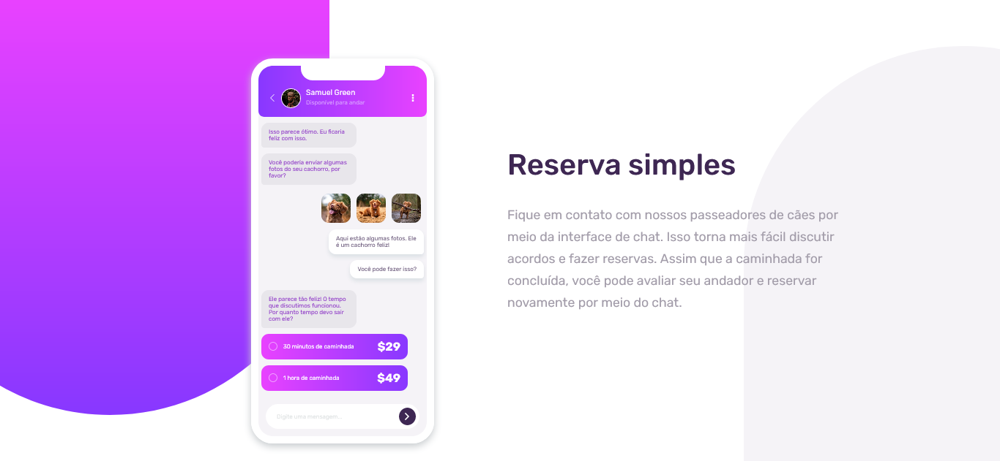
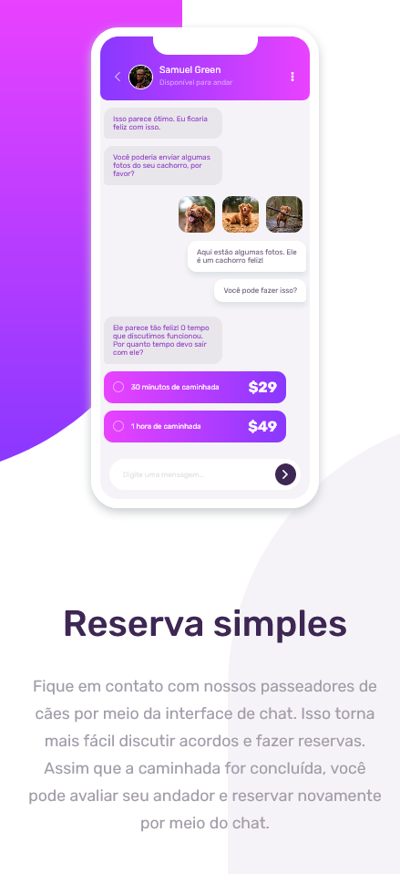

# Frontend Mentor - Ilustração CSS do aplicativo de bate-papo

Esta é uma solução para o desafio [Ilustração CSS do aplicativo de bate-papo no Frontend Mentor.](https://www.frontendmentor.io/challenges/chat-app-css-illustration-O5auMkFqY) Os desafios do Frontend Mentor ajudam você a melhorar suas habilidades de codificação ao construir projetos realistas.

## Índice

- [Visão geral](#visão-geral)
  - [O desafio](#o-desafio)
  - [Screenshot](#screenshot)
  - [Links](#links)
- [Processo](#processo)
  - [Construído com](#construído-com)
- [Autor](#autor)

## Visão geral

### O desafio

Os usuários devem ser capazes de:

- Visualize o layout ideal para o componente, dependendo do tamanho da tela do dispositivo
- Veja a interface de chat animada no carregamento inicial (opcional)

### Screenshot

### Links

- URL do site ao vivo: [Link](https://julioalves-dev.github.io/chat-app-css-illustration-master/)

## Processo

### Construído com

- HTML5
- CSS3

## Autor

- Frontend Mentor - [@JulioAlves-Dev](https://www.frontendmentor.io/profile/JulioAlves-Dev)
- Twitter - [@JulioAlv35](https://twitter.com/JulioAlv35)
- Linkedin - [Julio Alves](https://www.linkedin.com/in/julio-alves-0119b01a6/)
